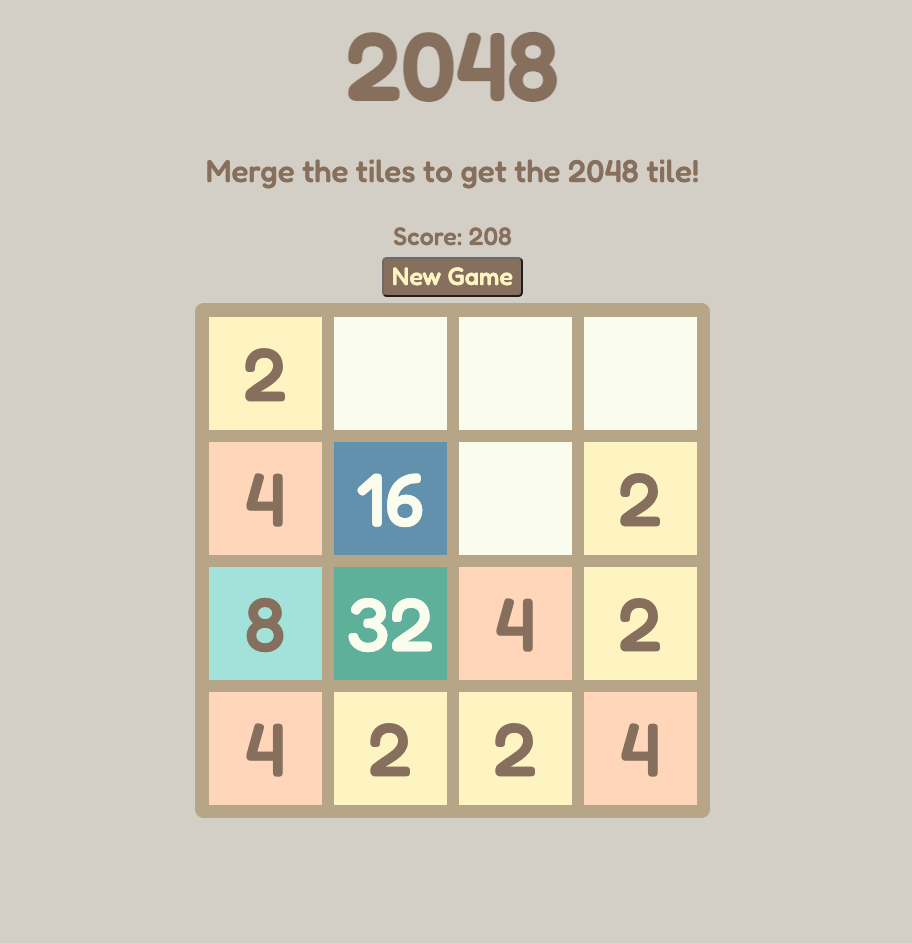
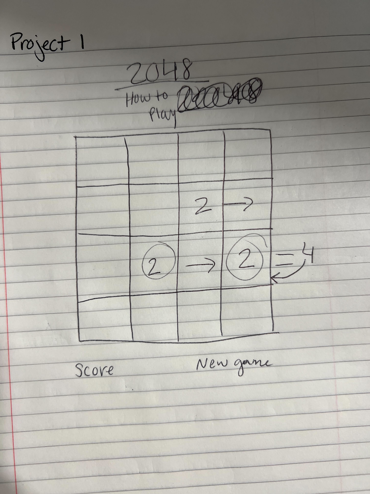

# 2048 - First Project

A simple recreation of the game 2048 using Javascipt, CSS, and HTML.

# Instructions

Use the arrow keys to merge tiles left, right, up, or down.
The goal is to continue merging until you get the tile 2048 on the game board.
If you fill up the board, the game is over.
Click new game to start fresh.

# Unfinished business & Major Hurdles

I still need to come back and add a high score counter that will save your progress each time you return.
Another goal is to play around with animation and learn how to implement that in my slide functions.

I reworked this game multiple different times, starting with the longest and most complicated ways each time.
Getting the up and down functions to work were the toughest. I had to pull each row at index 0,1,2,3 in order to make fake rows to then manipulate and put back where they belonged. It took a lot of trial and error but I got there.